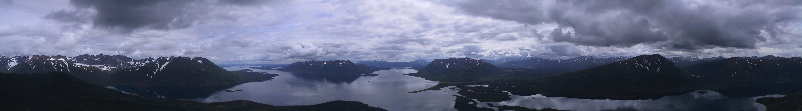

---
output:
  html_document:
    css: "custom_front_page.css"
---

```{r setup, include=FALSE}
knitr::opts_chunk$set(echo = TRUE)
```



***

I’m an applied ecologist at [NOAA](http://www.noaa.gov)‘s [Northwest Fisheries Science Center](https://www.nwfsc.noaa.gov/) and an Affiliate Associate Professor in the [School of Aquatic and Fishery Sciences](https://fish.uw.edu/) at the [University of Washington](https://www.washington.edu/).

I work on a variety of problems related to the conservation and management of aquatic resources, particularly along the west coast of North America. Much of my research is focused on the development and application of statistical methods for analyzing temporal and spatial data.

I advise post-docs and serve on graduate student committees in both formal and informal roles. Feel free to [contact me](https://faculty.washington.edu/scheuerl/CV.html) if you would like to discuss any aspect of your research.
